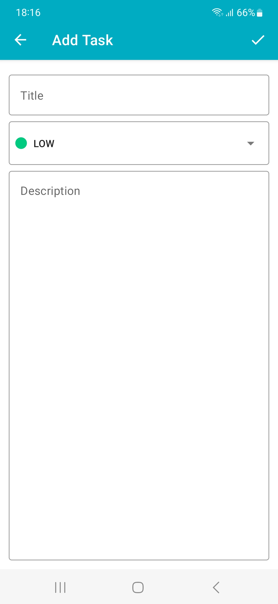

# ToDoCompose

ToDo App

Kotlin/Jetpack Compose application to make To-Do list. You can create, update and delete To-Do items. You can prioritize items with three different colors.

Keywords: Android, Kotlin, Jetpack Compose, CRUD-operations, Room database, dependency injection, Splash screen, Material UI

<table>
  <tr>
    <td>Splash Screen</td>
     <td>List Screen</td>
     <td>Create ToDo</td>
     <td>Update or Delete</td>
  </tr>
  <tr>
    <td></td>
    <td></td>
    <td></td>
    <td></td>
  </tr>
 </table>

